# Point Cloud Rendering in Unity

## Members:
- Isak Mäkimartti | IsakMakimartti
- Miro Hannikainen | MiroHann
- Noel Vähäjylkkä | NoelVahajylkka
- Märt Rahu | martrahu

# Introduction
The idea of this project was to create a Unity application in which we would import some point cloud data and render it. We were given a bunch of point cloud data files from which we chose those that ran the best on Unity; some of the files were quite large and would require resources we didn't have. Another goal was to possibly export the model using glTF. We didn't end up implementing this, due to time constraints.

## Additional tools or Unity Plugins used
- Pcx | https://github.com/keijiro/Pcx
  - Pcx is the tool we used to import and render the point cloud data in Unity. One small issue we noticed was that, as mentioned on the GitHub page, Pcx only accepts files in PLY format, while the files given to us were either LAS or E57 format. We used other tools to convert these to PLY in order to fix this issue.
- CloudCompare | https://www.cloudcompare.org/
  - Cloudcompare was used to both convert point-cloud data to another format; in our case PLY, and separate different parts of the data into their own objects (segmentation). Cloudcompare had many plugins which turned out to be useful in this.
- MeshLab | https://www.meshlab.net/
  - Meshlab, like CloudCompare, was also used for converting files to the correct format, in our case PLY.

## Tools we tested but didn't end up using
- Point Cloud Unity Plugin | https://ccom.unh.edu/vislab/tools/point_cloud_plugin/
  - This Plugin was originally our other option for bringing point cloud data into Unity. After trying to get it to work with Unity and our data, we were not able to make it work as intended, which is why we decided to use the above-mentioned Pcx instead.

# Converting LASer and E57 files to Unity-friendly format

## Software
We used Cloudcompare and MeshLab to convert the files from .las/.laz/.e57 file formats to .ply file format. We originally tried to convert the files using only Cloudcompare but after encountering multiple issues we found it easier to first convert the file from .las/.laz to .e57 in Cloudcompare and then import the converted file to MeshLab and convert it from .e57 to .ply.

## From LASer to E57

Cloudcompare supports a wide variety of different fileformats natively so one can just open a .las or .laz file from the dropdown file menu.

After importing a pointcloud file you can convert pointcloud data just by selecting the object on the DB Tree and then saving it as .e57 file from the save-button on the hotbar.

 

 

_Image of the DB Tree._

 

## From E57 to PLY

MeshLab supports .e57 files and the conversion to .ply works well. After importing the .e57 file to MeshLab you can select "Export Mesh As" from the dropdown menu and change the fileformat to .ply from the Resource Manager window that pops up. From our experience all of the files that were converted from .las or .laz to .e57 in Cloudcompare and then from .e57 to .ply in MeshLab worked in Unity without any issues.

# Segmenting a cloud point model for use in Unity

## Software
For segmentation we used the Cloudcompare software. Cloudcompare allows us to pretty effortlessly segment and edit any cloud point model before importing it to Unity. Cloudcompare is quite complex and can do pretty much everything needed to export a scene in usable pieces. 

## Simple Segmentation
Taking simpler, but rougher cuts out of a cloud point can be done with the segment tool. This tool can be used to draw out cuts with the selection tools inside or by using already drawn polylines made with the polyline drawing tool. 

    '

_Segmentation & polyline tool icons_

 

For our case these cuts are the easiest to take with the polyline tool. The polyline tool centers the camera for an eagle eye view of the model where you draw a section that you want to select. Using polyline makes sure the whole section is selected instead of a fragmented piece which can be the case with the selection tools inside the segment tool. 

 

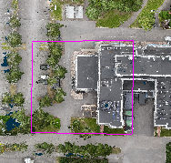 

_Image of polyline selection._

 

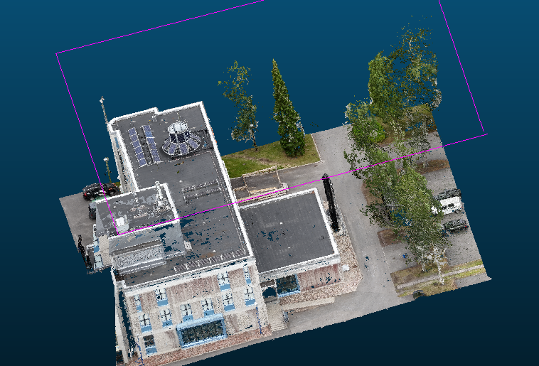 

_Image of polyline selection output._

 

The selection tools inside the segment tools can be used for more intricate cuts. 

 

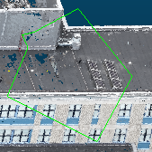 

_Image of segmentation tool selection._

 

The main issue of using the polyline tool is that for lower quality models it's harder to make sure the whole object is selected. One example of this would be a building inside a low quality cloud where the walls can be slanted which makes the cutting tools a bit more inconsistent. This can lead to walls of buildings that have gaps in them.

 

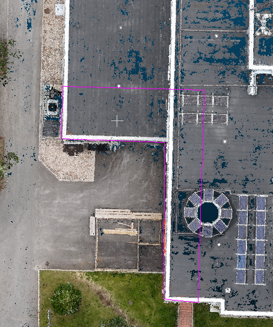 

_Image of polyline selection._

 

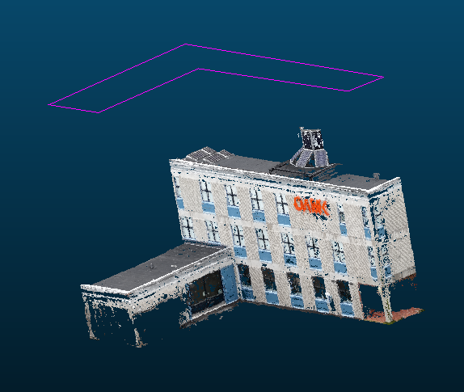 

_Image of building with gaps._

 

## Merging

For segmentation it's important to know that two separate clouds can be merged within Cloudcompare. This is important for cleaning up the results of the automatic tools. For an example I will merge together two separate trees into a single cloud. 

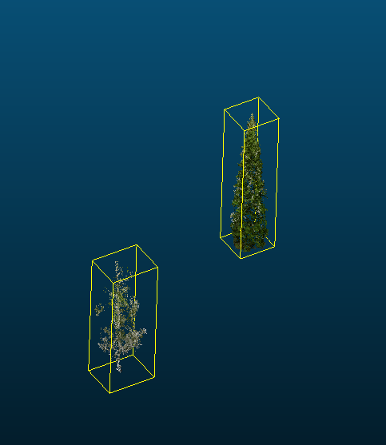

_Image of two trees that are separate clouds._

 

Selecting the two trees inside the DB tree will allow us to use the "Merge multiple clouds" tool which will result in a single cloud that includes both of the selected trees. 

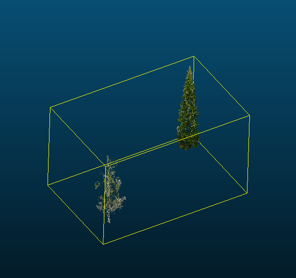

_Image of two trees that are the same cloud._

 

## Extracting trees from a cloud point scene
Using the before mentioned polyline or segment methods to try and extract trees from a scene would be very time consuming. Instead of using these tools we should start by subsampling a point cloud using Cloudcompares "Subsample a point cloud" tool. This should create a new subsampled model inside the DB tree. Inside the tool there should be a value for "min. space between points" that needs to be adjusted. Lowering the value will make the sampling more accurate at the cost of performance while making it higher will result in a lower quality output.

 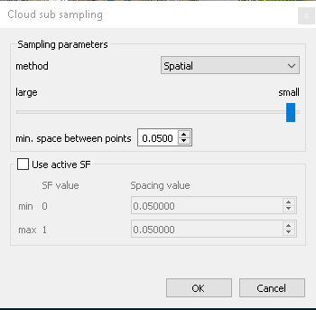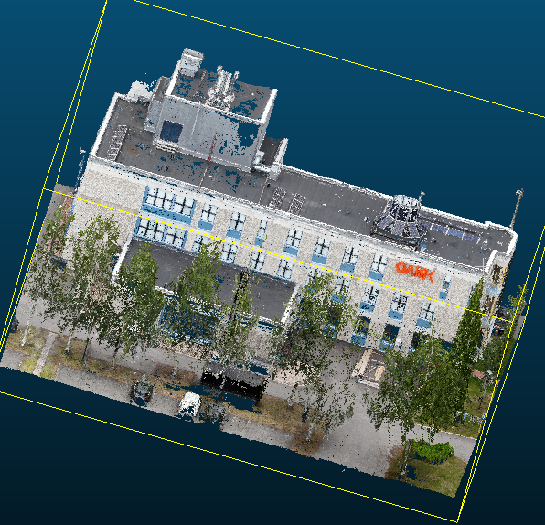

_Image of the the used subsampling settings and the output._

 

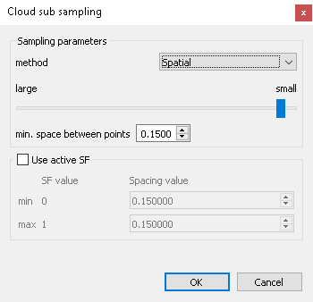 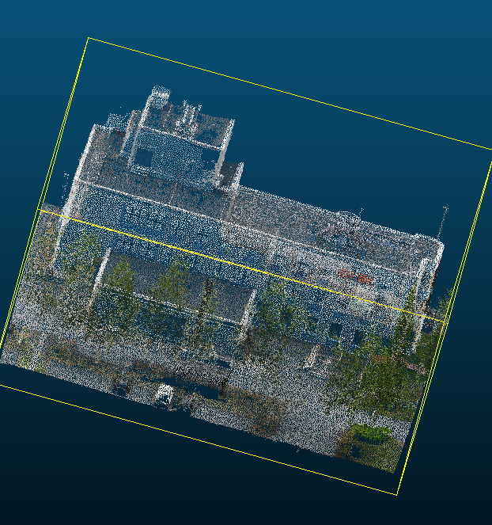

_Image of the the higher value subsampling settings and the output._

 

This makes it possible for us to seperate the off and on ground points into to different clouds. Cuttings the clouds can easily be done using the CSF filter tool inside Cloudcompare. The important thing to note on using CSF is the "Classification threshold". This value needs to be tweaked up or down depending on the elevation changes inside the cloud point data for it to transform the right objects into off ground objects. The main issue with using CSF is that it also cuts off other off ground objects such as cars, light poles, fences etc. If the cloud point data has big changes in elevation some cutting and merging is needed to stitch together the different ground points depending on elevation.

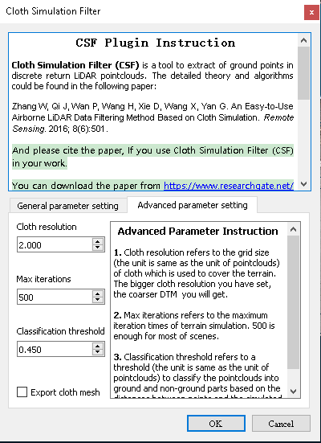

_Image of CSF settings used for example._

 

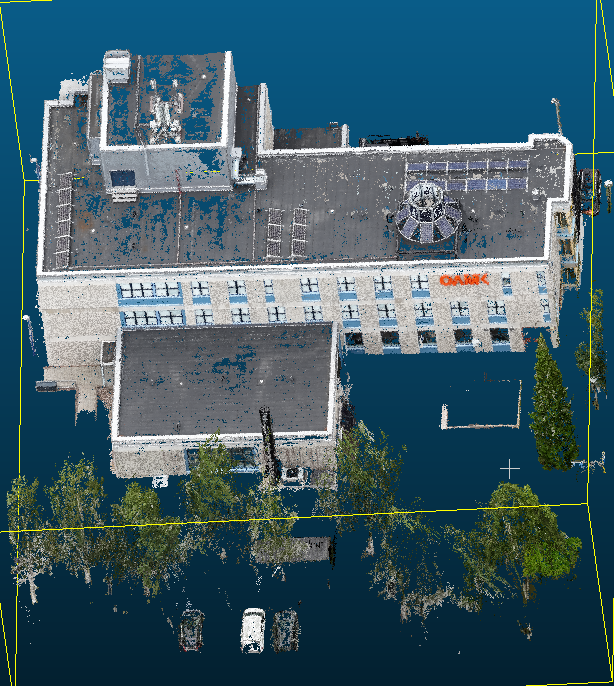 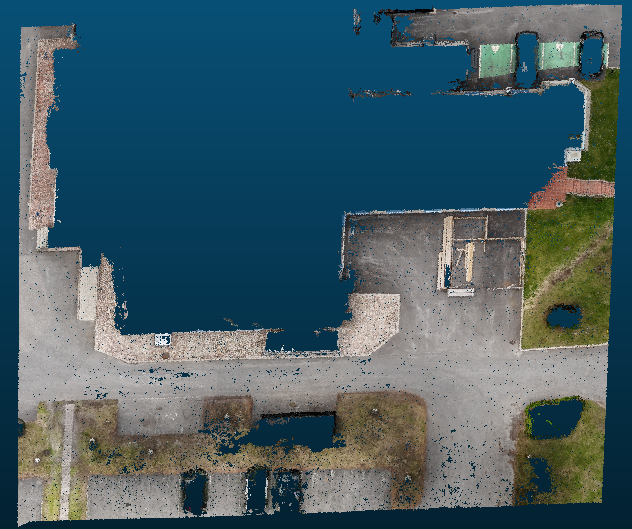

_Images of off and on ground points._

 

This is where you will have to do some manual cleaning up using the before mentioned segmentation tools and pasting them back onto the desired cloud by merging the cleaned objects. This is also a good time to cut out any building etc you would want separate from the main clouds.

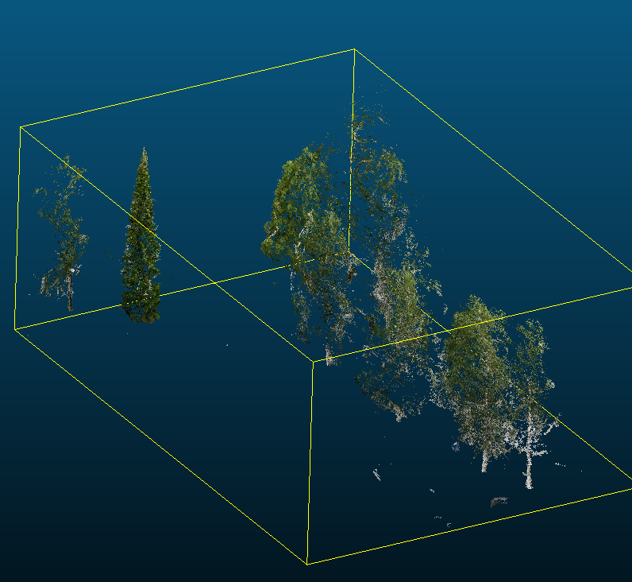 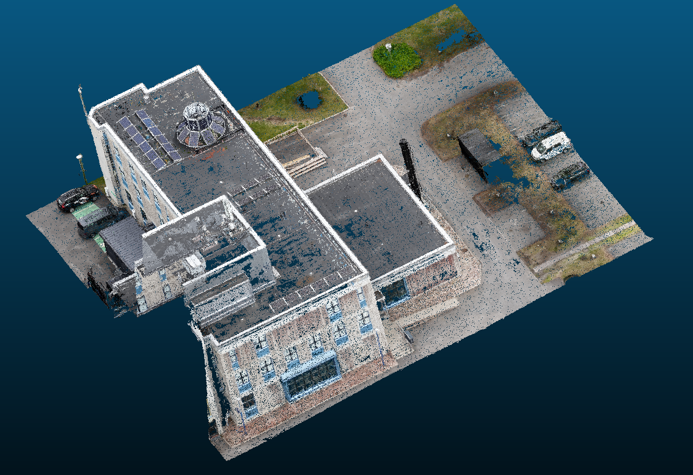

_Image of cleaned off and on ground points._

 

 After cleaning your off ground objects should only consist of desired objects. Now we can use the "connected components" to automatically separate the cloud into their own objects by adjusting the "minimum points per component" value. Good value to start off with is atleast 500. This varies depending on the quality and size of the cloud. 

 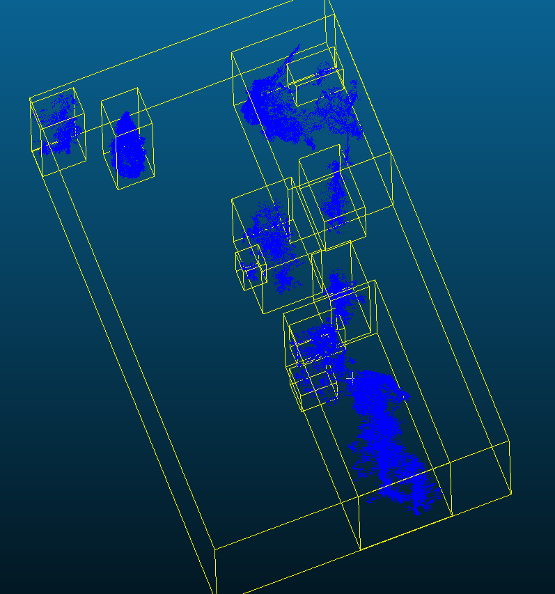

_image of the connected components settings and the following output with scalar field colors._

 

Now that the objects are roughly cut out of eachother, we need to attach the smaller pieces back into the correct objects and seperate some of the larger clusters.

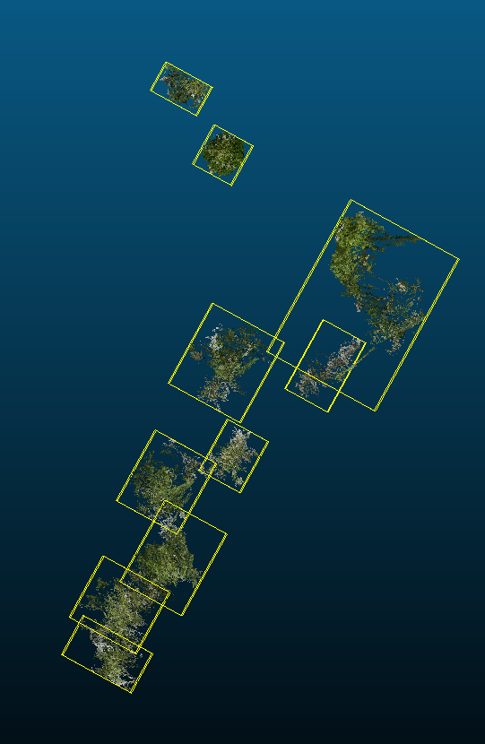 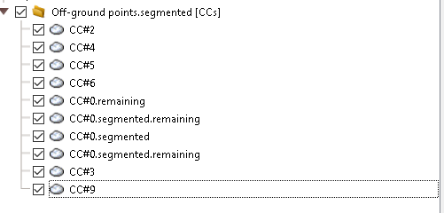

_Image of trees that have been separated and an image of the DB tree with all the elements seperated._

 

Now all the elements are ready to be exported after doing some cleaning with the merge and segmentation tools. 

# Rendering

## Rendering of the model
The converted *.ply files were imported into Unity using the Pcx plugin. The imported models are rendered in Unity using the default material and shader provided by Pcx. The normals contained in the ply files are not transferred to Unity. The Pcx shader displays each point using its scanned color. This shader does not interact with lighting in any way, nor does it support casting or receiving shadows.

## Receiving and Casting Shadows
To display shadows, the model must be rendered with a shader that participates in Unity’s shadow generation. Depending on the project settings, Unity uses either the Built-in (Standard), Universal Render Pipeline (URP), or High Definition Render Pipeline (HDRP).

If the standard renderer is used, Unity’s built-in surface shaders are responsible for generating shadows. However, these shaders do not automatically take vertex colors into account — the model is instead colored based on its texture. As a result, when using this shader, the model only appears with its Base Color. The surface shader's source code mainly exposes settings related to parameters, while the vertex and fragment functions are handled automatically by Unity. Therefore, modifying the source code did not make it possible to display the model with its vertex colors.

If the newer URP renderer is used, the Lit shader is responsible for generating shadows. This shader also does not natively support vertex colors, so the model is shown only with the Base Color. However, URP allows the use of Shader Graph, where a Vertex Color node can be fed into the fragment section, enabling the model to appear in color. The Lit shader also adjusts the appearance based on lighting. Thus, using URP and Shader Graph, it is possible to show both shadows and vertex colors, and the models react to lighting. However, realistic rendering is still limited due to the lack of normals.

## Normals
Pcx uses Unity’s Mesh class functions SetColors and SetVertices to create the model in Unity. The Mesh class also includes a SetNormals function, and by adding this functionality to the Pcx importer, it would be possible to include normals in the model as well. Another option would be to create a script that approximates the normal of each point based on the positions of its n nearest neighbors (which, as I understand, is the method typically used by LiDAR scanners to generate normals).

# Tidbits:
# Conclusion:
The main conclusion of this project is that It's feasible to turn cloud point data into a usable 3D environment inside unity. It can be done quite quickly with the help of the before mentioned tools for a better quality output. This also allows for a dynamic scene that can be fitted for multiple different uses cases. The only issue that we ran into was with realsitic lighting for the scene. Lighting can be applied through the use of unity universal render pipeline, but this leads to a lower quality scene in comparison to other methods. This seems like an issue that could have been corrected with time, but for this project we settled with unity universal render pipelines results. 

_Image of a scene with the before mentioned lighting_

 

This demo can be found here: 
[https://drive.google.com/file/d/1th97bn8TojdCD0bQDC5Hj3NtyArEzP6L/view?usp=sharing](https://drive.google.com/file/d/1th97bn8TojdCD0bQDC5Hj3NtyArEzP6L/view?usp=sharing)
<!--

**Here are some ideas to get you started:**

🙋‍♀️ A short introduction - what is your organization all about?
🌈 Contribution guidelines - how can the community get involved?
👩‍💻 Useful resources - where can the community find your docs? Is there anything else the community should know?
🍿 Fun facts - what does your team eat for breakfast?
🧙 Remember, you can do mighty things with the power of [Markdown](https://docs.github.com/github/writing-on-github/getting-started-with-writing-and-formatting-on-github/basic-writing-and-formatting-syntax)
-->
